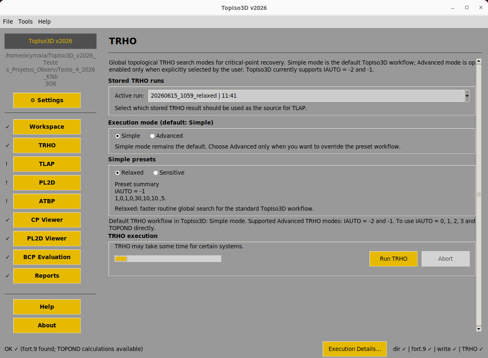

# TopIso3D v2026



TopIso3D is a graphical interface for topological analysis of electronic density from CRYSTAL/TOPOND calculations.

## Features

- Visualization of critical points
- Bond path analysis
- TRHO/TLAP workflow support
- Report generation
- Excel and CSV export
- Cross-platform support (Windows, macOS and Linux)

## Supported platforms

- Windows
- macOS
- Linux

## Source code

Main application:

```
TopIso3D_v2026.py
```

## Website

https://topiso3d.ufpb.br

## Authors

Ary da Silva Maia  
Federal University of Paraíba (UFPB)

Developed in collaboration with the University of Turin (UNITO).
